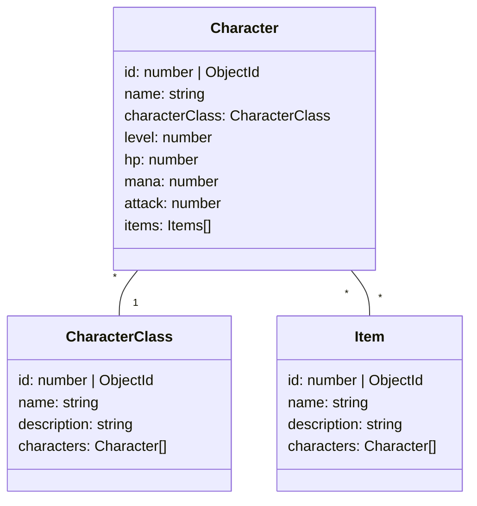

# Hero Clash 4 Geeks (with ORM/ODM)

## Introducción

En este ejemplo vamos a desarrollar los CRUD (ABMC) utilizando una API REST con express y utilizando un ORM (object relational mapper) u ODM (object document mapper) para la persistencia. Cuando un mismo mapper sirve tanto para la persistencia en bases de datos relacionales como en document store se suele nombrar como OxM ya que permite mapear a más de uno.

El OxM que utilizaremos es [MikroORM](https://mikro-orm.io/). Que tiene soporte para multiples bases de datos relacionales y también MongoDB.

En particular para poder demostrar los beneficios de un ORM es necesario mostrar ocmo implementar relaciones 1aN y NaM por lo que agregaremos a nuestra app 2 clases más:

Items y CharacterClass que dejarán de ser strings y serán entidades por derecho propio. Como se muestra en el diagrama de clases a continuación:

## Class diagram

## Lectura Adicional

Basado en los patrones:

- [Data Mapper](https://www.martinfowler.com/eaaCatalog/dataMapper.html),
- [Unit of Work](https://mikro-orm.io/docs/unit-of-work)
- [Identity Map](https://mikro-orm.io/docs/identity-map)
